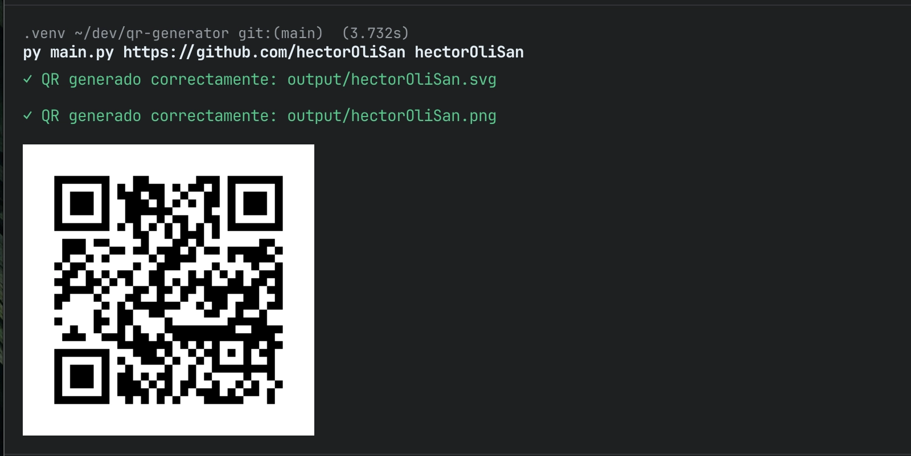

# QR Code Generator

- Generate QR codes from URLs
- Saved in SVG and PNG format
- Display in the terminal using `imgcat`
- Error handling with styled messages
- Argument validation
- Simple command-line interface




## Requirements

- Python 3.8 or newer
- `pip` (Python package manager)

## Installation

1. Clone the repository or download the project files.

```bash
git clone git@github.com:hectorOliSan/get-frame.git
```

2. Create a virtual environment:

```bash
python -m venv .venv
```

3. Activate the virtual environment:

```bash
source .venv/bin/activate     # Linux/macOS
.venv\Scripts\activate        # Windows
```

4. Install the dependencies:

```bash
pip install -r requirements.txt
```

## Project Structure

```
qr-generator/
├── output/              # Directory where QR codes are saved
├── main.py              # Main file with the generator logic
├── decorators.py        # Decorators for error handling and styling
├── requirements.txt     # Project dependencies
├── .gitignore
└── README.md
```

### Dependencies

- `qrcode[pil]`: Library to generate QR codes
- `imgcat`: Image rendering in the terminal
- `rich`: Terminal styling and colors

## Usage

```bash
python main.py <url> <filename>
```

- `<url>`: URL or link for which the QR code will be generated. It can be a full URL (with `https://`) or a simple domain (e.g. `example.com`).
- `<filename>`: Base name for the generated files. Two files will be created:
  - `<filename>.svg` - SVG version
  - `<filename>.png` - PNG version

```bash
python main.py https://example.com my_qr_code
```

## Output

Generated files are saved in the `output/` directory, which is created automatically if it does not exist.

The QR code is also displayed directly in the terminal if your terminal supports `imgcat`.
